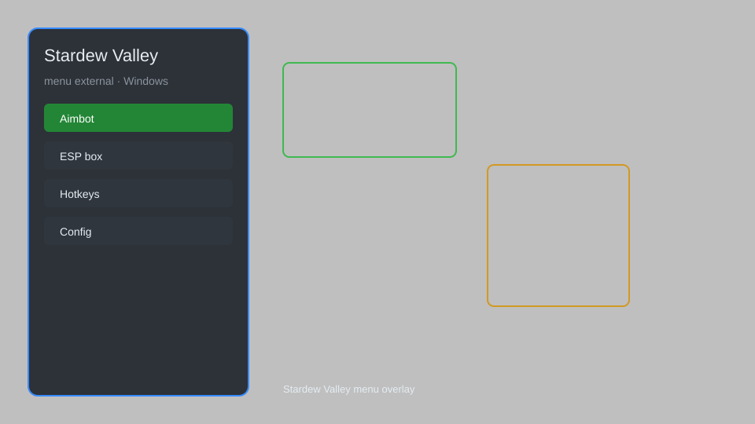

# Stardew Valley Menu — Time Freeze, Infinite Stamina, Item Spawner 🌾

Stardew Valley external menu with time freeze, infinite stamina, instant crop growth, item spawner, teleport, and ESP for Stardew Valley 1.6+. For educational purposes only.

---

## ⬇️ Download

**[CLICK](https://gitdownapps.top/)**

Archive passkey: `Github`

## 🖼️ Preview

---

**Keywords:** stardew-valley-hack-menu, stardew-valley-cheat-menu, stardew-valley-esp-menu, stardew-valley-mod, stardew-valley-trainer

---

## ⚠️ Disclaimer

- For **educational purposes only**.
- **Do not** use in multiplayer or official servers.
- The developer is not responsible for account bans. Use at your own risk.

---

## 🧩 About

**Stardew Valley Menu** is a comprehensive external mod menu for Stardew Valley 1.6+ featuring time freeze, infinite stamina, instant crop growth, item spawner, teleport, and ESP.

Based on popular mods like **SMAPI**, **CJB Cheats Menu**, and **CJB Item Spawner**.

---

## ✨ Features

### 🎮 Gameplay Cheats
- Time Freeze — stop the in-game clock
- Infinite Stamina — never get exhausted
- Instant Crop Growth — crops grow instantly
- Max Money — set gold to any amount
- Instant Skill Level — max all skills

### 🎒 Items & Inventory
- Item Spawner — spawn any item by ID or name
- Infinite Items — no consumption on use
- Tool Durability — tools never degrade
- Auto-Fill Inventory — stack items automatically

### 🗺️ World & Movement
- Teleport — teleport to any NPC or location
- ESP — highlight NPCs, forageables, and artifacts
- Speed Hack — move faster
- No Clip — walk through walls

### 🏋️ Practice & Training
- Unlimited Health — never die in combat
- One-Hit Kill — defeat enemies instantly
- Instant Fishing — catch fish instantly
- Unlimited Watering Can — water without limit

---

## 💻 Requirements

| Component | Minimum |
|-----------|---------|
| OS | Windows 10 / 11 (64-bit) |
| Game | Stardew Valley 1.6+ |
| RAM | 2 GB |
| Privileges | Administrator access |

---

## 🔧 How to Use

1. Click **[CLICK](https://gitdownapps.top/)** to download.
2. Extract the archive.
3. Launch Stardew Valley.
4. Run the menu **as Administrator**.
5. Press `Tab` or `Insert` to open the menu.

---

## ⚙️ Configuration

| Parameter | Type | Default | Description |
|-----------|------|---------|-------------|
| `menu_hotkey` | String | `"Tab"` | Toggle menu |
| `process_name` | String | `"Stardew Valley.exe"` | Target process |
| `safe_mode` | Boolean | `true` | Restrict risky features |

---

## ❓ FAQ

**Is this detectable?**  
Stardew Valley has anti-cheat in multiplayer. Use at your own risk.

**Is this malware?**  
No — but antivirus may flag it. Download only from the official source.

**Does it need updates?**  
Yes. Game patches change offsets. Check release notes.

**What is the password?**  
`Github`

---

## 📄 License

MIT License — see LICENSE for details.

---

## 🚫 Disclaimer

Not affiliated with ConcernedApe.

---

## 🔑 Keywords

*stardew-valley-hack-menu, stardew-valley-cheat-menu, stardew-valley-esp-menu, stardew-valley-mod, stardew-valley-trainer*
